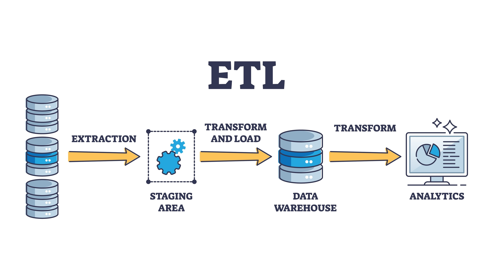
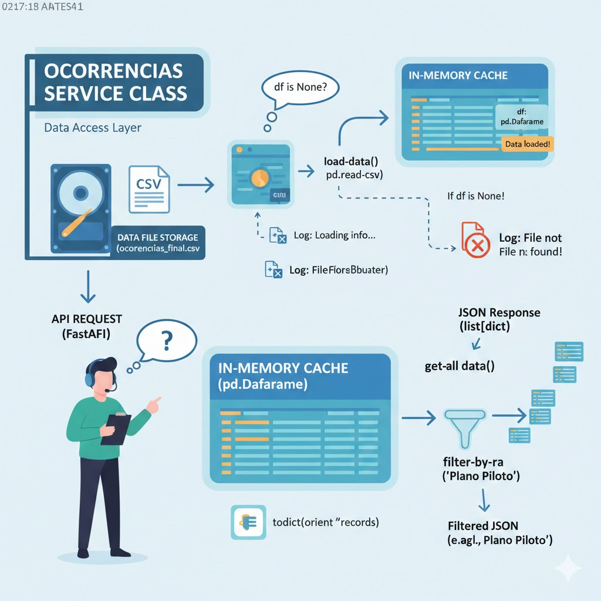

# ROTEIRO PROJETO API OCORRÊNCIAS SSPDF

## 1 SETUP INICIAL DO PROJETO

### 1.1 CRIAÇÃO DO DIRETÓRIO PAI DO PROJETO

```bash
mkdir projeto-ml-api
cd projeto-ml-api
```

### 1.2 INICIAR O GIT

```bash
git init
```

### 1.3 INSTALAR / ATIVAR VENV

```bash
python3.12 -m venv venv

source venv/bin/activate
```
### 1.4 Criar estrutura de diretórios

```bash
mkdir src
mkdir src/api
mkdir src/data
mkdir src/data/etl
mkdir src/data/etl/extractors
mkdir src/data/etl/transformers
mkdir src/data/etl/loaders
mkdir src/models
mkdir src/schemas
mkdir src/services
mkdir tests
mkdir logs
mkdir artifacts
mkdir artifacts/models
```
```
proj_api_dados_sspdf/
├── artifacts/
│   └── models/
|        └── __init__.py
├── logs/
│   └── __init__.py
├── src/
│   ├── __init__.py
│   ├── config.py
│   ├── api/
│   │   ├── __init__.py
│   │   └── main.py
│   ├── data/
│   │   ├── __init__.py
│   │   ├── pipeline_etl.py
│   │   ├── pipeline_etl.ipynb
│   │   ├──ocorrencias_consolidado_2020_24.csv
│   │   ├──ocorrencias_natureza.csv
│   │   └──ocorrencias_ra.csv
│   ├──models/
│   |   └── __init__.py
│   ├── schemas/
│   |   ├── __init__.py
│   │   └── schemas.py
│   ├── services/
│   |   ├── __init__.py
│   │   └── services.py
├── tests/
│   └── __init__.py
├── .gitignore
├── requirements.txt
└── README.md
```

### 1.5 Criar arquivos `__init__.py`

```bash

# Mac/Linux
touch src/__init__.py
touch src/api/__init__.py
touch src/data/__init__.py
touch src/data/etl/__init__.py
touch src/data/etl/extractors/__init__.py
touch src/data/etl/transformers/__init__.py
touch src/data/etl/loaders/__init__.py
touch src/models/__init__.py
touch src/schemas/__init__.py
touch src/services/__init__.py
touch tests/__init__.py
```

### 1.6 Criar arquivos de configuração

**Criar `.gitignore`:**
```
venv/
__pycache__/
*.pyc
.pytest_cache/
.mypy_cache/
.ruff_cache/
logs/*.log
.env
*.pkl
.DS_Store
```

**Criar `requirements.txt`:**
```
fastapi==0.109.0
uvicorn[standard]==0.27.0
pydantic==2.6.0
pytest==7.4.3
pytest-cov==4.1.0
black==24.1.1
ruff==0.1.15
mypy==1.8.0
httpx==0.26.0
scikit-learn==1.4.0
pandas==2.2.0
seaborn==0.13.2
matplotlib==3.7.2
```

### 1.7 Instalar dependências

```bash
pip install -r requirements.txt
```

---

## 2.0 Repositório Github 

### 2.1 Criar o Repositório Vazio no GitHub

Acesse o GitHub no navegador.

Clique no botão "New" (Novo) para criar um novo repositório.

Dê o nome proj_api_dados_sspdf (mesmo nome da sua pasta local).

Defina-o como Public.

Clique em "Create repository".


# 2.2 Conectar repositório remoto

 - O GitHub fornecerá a URL do repositório. Você usará essa URL para conectar sua pasta local.

 - Copie a URL do repositório vazio (use a opção HTTPS).

```bash
git remote add origin https://github.com/phmcasimiro/proj_api_dados_sspdf.git
``` 

### 2.3 Inicializar o repositório local

```bash
git add .
git commit -m "Initial commit"
git push -u origin main
```

## 3 Logs


## 4 Pipeline de Dados



**OBSERVAÇÃO:** O objetivo do diretório src/data é armazenar os arquivos de dados brutos e os arquivos de dados processados, além do arquivo de configuração do pipeline ETL _pipeline_etl.py_. Neste diretório é armazenada a lógica de extração, transformação e carregamento dos dados. Importante destacar que o webscraping não foi realizado, por isso os arquivos .csv foram baixados manualmente e disponibilizados no repositório;

**Repositório de Dados Raw:** _src/data/;_

**Arquivos Raw:** _ocorrencias_ra.csv; ocorrencias_natureza.csv; ocorrencias_consolidado_2020_24.csv_

**Fonte de Dados:** [SSP-DF Ocorrências Policiais](https://www.ssp.df.gov.br/dados-por-regiao-administrativa/);


## 5 Services



**OBSERVAÇÃO:** O Objetivo do diretório _src/services_ é armazenar a lógica de negócio da API, ou seja, armazenar os scripts que serão usados para carregar o dataframe principal em mémória por meio do ***método load_data()*** da ***Classe OcorrenciasService*** e também disponibilizar os dados em formato JSON para as rotas da API por intermédio do ***método get_all_data()*** da ***Classe OcorrenciasService***.


## 6 Main


## 7 Schemas